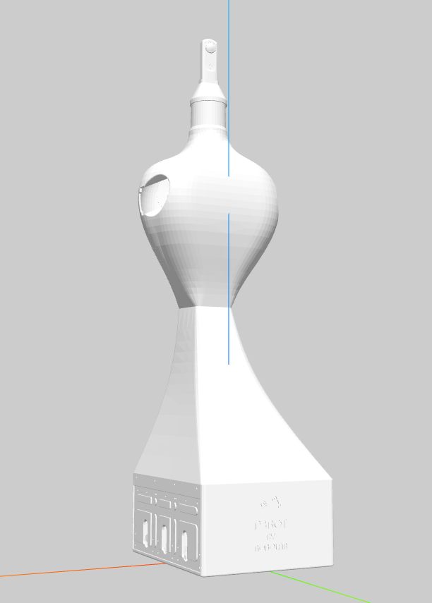

# URDF's changes

## Cube and square
Additionally, a new URDF file was created using the cube_small.urdf file from the pybullet_data package.
The URDF file was modified to changes the height of the cube to 0.1m to do more similar to a plane square.
This URDF was named cube_small_square.urdf and is located in URDFs/cube_and_square.

## Cylinder
The URDF file cylinder.urdf was created using the cylinder.obj file that was created using Blender.

## Kinova arm
The URDF file obtained from the Kinova website was modified to include the necessary information for the simulation.
The changes made to the URDF file was include a link to fix the base of the robot to the world frame.
This URDF was named gen3_robotiq_2f_85-mod.urdf and is located in URDFs/kinova_with_pybullet.

## Arms base
This was a temporal base for the arms that was created using Blender. The URDF file was created using the arms_base.obj file.

## P3Bot
The URDF of the P3Bot was created combining the URDF obtained from SolidWorks about the base of the robot, and the URDF obtained from the URDF file of the Kinova arm modified.

